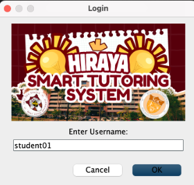

# Hiraya: Smart Tutoring System

A comprehensive Java-based educational platform featuring flashcard management, adaptive quizzing, and personalized learning recommendations. Built with Object-Oriented Programming principles for the 2090-6OOP (NW-201) course at Holy Angel University.

## 🎯 Overview

**Hiraya STS** (Smart Tutoring System) is an interactive learning platform designed to help students master various computer science topics through flashcards and adaptive quizzes. The system supports multiple user roles (Student, Tutor, Admin) and provides personalized learning experiences based on performance tracking.

## 👥 Contributors

- **Abrazado, Jin Gaila B.**
- **Bautista, Mark Anthony A.** (@MrkHammy)
- **Costigan, Jennilyn Y.**
- **Feliciano, Angelo Iñigo D.** (@xnv0)

## 📸 Sample Output
### Screenshot 1

### Screenshot 2

---

## 🔐 Login Credentials

### Sample User Accounts

The system comes preloaded with sample accounts for testing. Use these credentials to explore different user roles:

#### 👨‍🎓 Student Accounts
| Username | Password | Description |
|----------|----------|-------------|
| `student01` | `password` | Juan Dela Cruz - Computer Science student with sample quiz history |
| `student02` | `pass123` | Maria Santos - Information Technology student |

#### 👨‍🏫 Tutor Accounts
| Username | Password | Expertise |
|----------|----------|-----------|
| `tutor01` | `tutorpass` | Prof. Santos - Software Engineering specialist |
| `tutor02` | `coachpw` | Coach Reyes - Cybersecurity specialist |

#### 👨‍💼 Admin Account
| Username | Password | Access Level |
|----------|----------|--------------|
| `admin` | `admin` | Super Administrator - Full system access |

---

### User Roles & Permissions

| Role | Permissions |
|------|-------------|
| **Student** | View flashcards, take quizzes, view performance analytics, get personalized recommendations |
| **Tutor** | All student permissions + Create/Edit/Delete flashcards, manage content |
| **Admin** | System administration, user management, data backup, view all users |
### Quick Start Guide

---

1. **For Students**: 
   - Login with `student01` / `password`
   - Select a course, review flashcards, and take practice quizzes

2. **For Tutors**: 
   - Login with `tutor01` / `tutorpass`
   - Create, edit, or delete flashcards to manage content

3. **For Admins**: 
   - Login with `admin` / `admin`
   - View all users and perform system backup operations
## ✨ Features

### 🎓 Student Features
- **Course Selection**: Choose from 4 comprehensive computer science courses
- **Flashcard Review Mode**: Browse and study flashcards with pagination and shuffle functionality
- **Practice Quiz Mode**: Three difficulty levels
  - **Easy**: Multiple choice with hints
  - **Medium**: Multiple choice without hints
  - **Hard**: Identification questions with progressive hints
- **Performance Tracking**: Automatic recording of quiz attempts and accuracy
- **Personalized Recommendations**: Get suggestions for weak topics (below 40% accuracy)
- **Course Filtering**: Filter flashcards by selected course

### 👨‍🏫 Tutor Features
- **Flashcard Management**:
  - Create new flashcards with term, definition, and topic
  - Edit existing flashcards
  - Delete flashcards
  - Review all flashcards in the system
- **Topic Organization**: Organize content by course topics

### 👨‍💼 Admin Features
- **User Management**: View all registered users and their roles
- **Data Backup**: Simulate system backup functionality
- **System Overview**: Monitor overall system statistics

### Security Note

⚠️ **These are sample credentials for demonstration purposes only.** 

In a production environment:
- All passwords should be hashed and salted
- Users should be required to change default passwords
- Implement password complexity requirements
- Add account lockout mechanisms after failed attempts
- Store credentials securely in a database

